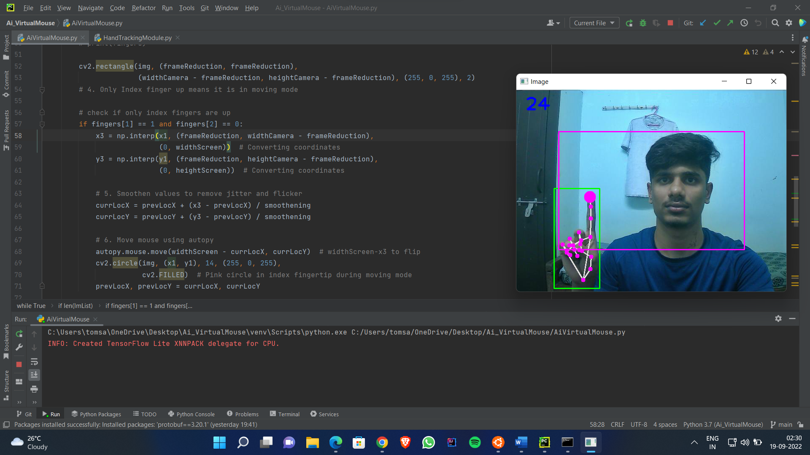
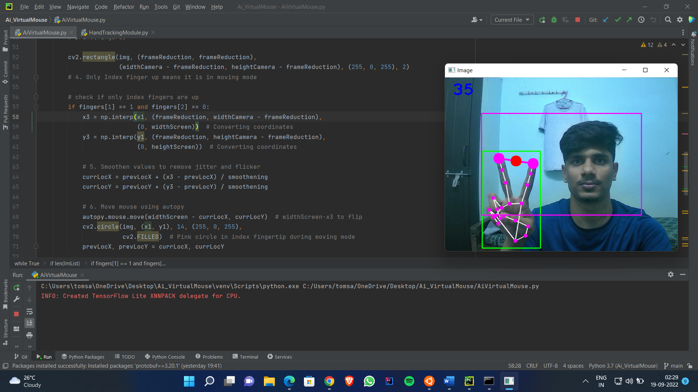

# AI Virtual Mouse Using openCV

<h4>
In this project, I have created an AI based Mouse Controller. First we detect the hand landmarks and then track and click based on these points. We will also apply smoothing techniques to make it more usable.
</h4>
<h4>Packages used:  &emsp;&emsp;opencv-python &emsp;&emsp;mediapipe (v4.0.0) &emsp;&emsp;autopy (v4.0.0) &emsp;&emsp;portobuf (v3.20.1)</h4>

<h5>NOTE: USE Python version 3.7.0 as few packages used wont support in higher versions of python.</h5>

<h3>How to run?</h3>
<ol>
  <li>Clone the repository.</li>
  <li>Download python v3.7.0 as mediapipe and autopy wont work on latest python versions.</li>
  <li>Open the cloned repository folder as a project on any IDE (I used pycharm) and change python interpreter to 3.7.0.</li>
  <li>Install all the above mentioned packaged.</li>
  <li>Run.</li>
  <li>Use Ctrl+F2 to Quit.</li>
</ol>

